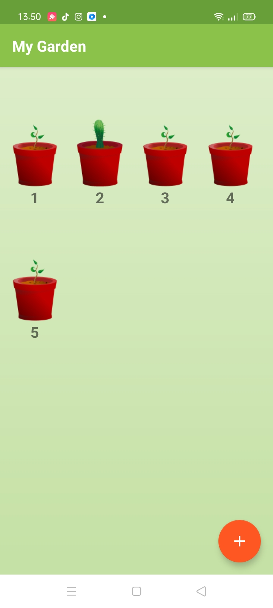
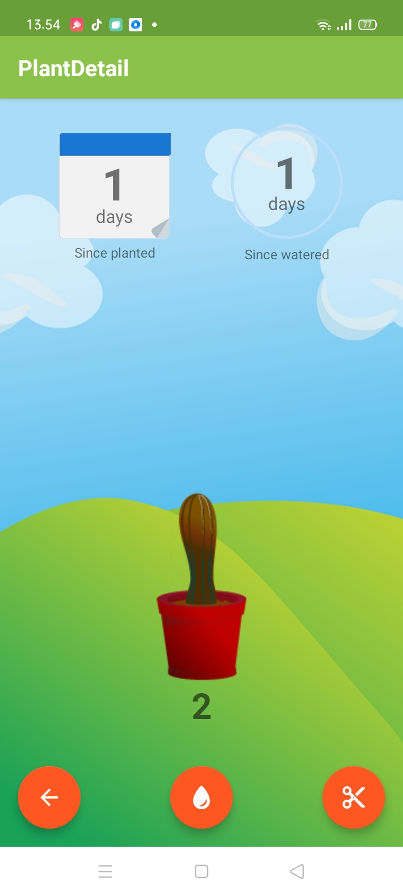

# Tentang
>Repositori ini dibuat berdasarkan course dari udacity yang telah di sesuaikan dengan android studio versi terbaru
- jika ingin melihatnya bisa [klik disini](https://classroom.udacity.com/courses/ud855/lessons/f133dd92-8e3c-40b9-9d9d-545498638459/concepts/98627458-72ac-45a0-94ff-bca60428ccfc)

# NB
- [x] versi android studio saat ini dan versi android studio pada udacity berbeda

- [x] jika menggunakan android studi versi saat ini anda bisa mengubah menjadi android x

# Widget
>Widget adalah sebuah “perwakilan” dari aplikasi yang memungkinkan pengguna untuk dapat menggunakan fitur dari aplikasi yang diwakilkan tersebut secara langsung tanpa harus membuka aplikasi “sesungguhnya”.

[Selengkapnya](https://techijau.com/apa-itu-widget-android/)

# Fungsi Button Tambah
>Button tambah berfungsi untuk menambahkan tanaman pada halaman utama berikut hasilnya

# Tampilan Setelah Tambah
>Setelah menambahkan tanaman maka akan ditujukan ke sebuah halaman berikut tampilannya

# Tampilan Tanaman mati
>ketika tanaman lama tidak di siram maka tanaman akan mati 
seperti berikut

# Contoh Tanaman sebelum disiram

# Contoh Tanaman setelah disiram

# Widget MyGarden
>Pada aplikasi MyGarden terdapat fitur widget, cara menambahkannya pada handphone realme tekan lama kemudian pilih widget>mygarden>seret ke layar

# Widget ketika dilebarkan
> Ketika dilebarkan widget akan meluas dan menampilkan seluruh tanaman

## Resources gambar
### link berikut
- [x] sapling-plant-growing-seedling  [Klik Disini ](https://pixabay.com/en/sapling-plant-growing-seedling-154734/).
- [x] cactus-cacti-plant-thorns-spiky  [Klik Disini ](https://pixabay.com/en/cactus-cacti-plant-thorns-spiky-152378/).
- [x] the-background-background-design  [Klik Disini ](https://pixabay.com/en/the-background-background-design-352165/).

## Arigatōgozaimashita, Gamsahabnida, Maturnuwun, Terimakasih🤗
